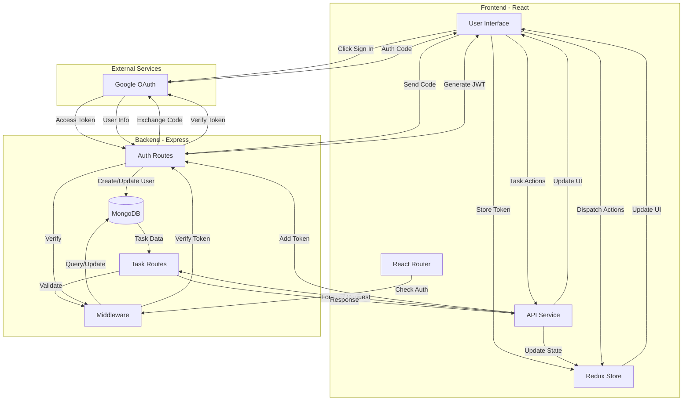
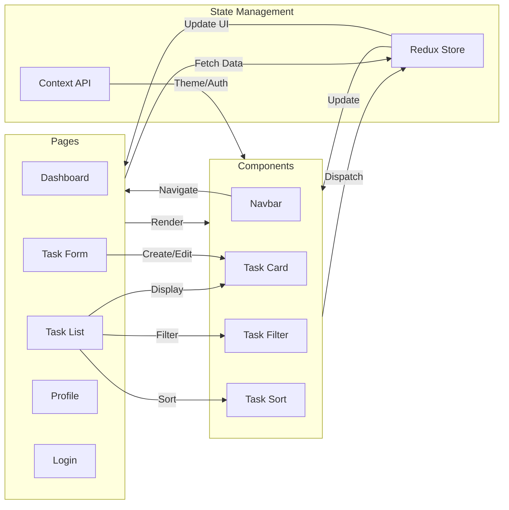
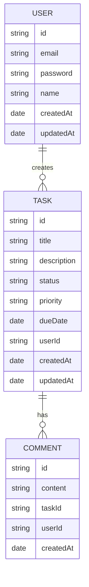
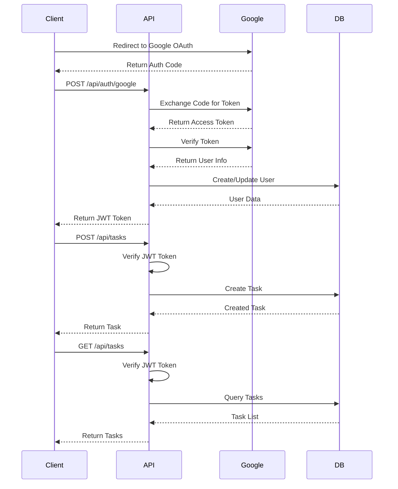

# TaskFlow - Data Flow Diagram

## Application Data Flow

```mermaid
graph TD
    subgraph Frontend[Frontend - React]
        UI[User Interface]
        Redux[Redux Store]
        Router[React Router]
        API[API Service]
    end

    subgraph Backend[Backend - Express]
        Auth[Auth Routes]
        Task[Task Routes]
        Middleware[Middleware]
        DB[(MongoDB)]
    end

    subgraph External[External Services]
        Google[Google OAuth]
    end

    %% Google OAuth Flow
    UI -->|Click Sign In| Google
    Google -->|Auth Code| UI
    UI -->|Send Code| Auth
    Auth -->|Exchange Code| Google
    Google -->|Access Token| Auth
    Auth -->|Verify Token| Google
    Google -->|User Info| Auth
    Auth -->|Create/Update User| DB
    Auth -->|Generate JWT| UI
    UI -->|Store Token| Redux

    %% Task Operations Flow
    UI -->|Task Actions| API
    API -->|Forward Request| Task
    Task -->|Validate| Middleware
    Middleware -->|Query/Update| DB
    DB -->|Task Data| Task
    Task -->|Response| API
    API -->|Update UI| UI
    API -->|Update State| Redux

    %% Protected Routes
    Router -->|Check Auth| Middleware
    Middleware -->|Verify Token| Auth

    %% State Management
    Redux -->|Update UI| UI
    UI -->|Dispatch Actions| Redux

    %% API Service
    API -->|Add Token| Auth
    Auth -->|Verify| Middleware
```

## Component Interaction Flow

```mermaid
graph LR
    subgraph Pages[Pages]
        Dashboard[Dashboard]
        TaskList[Task List]
        TaskForm[Task Form]
        Profile[Profile]
        Login[Login]
    end

    subgraph Components[Components]
        Navbar[Navbar]
        TaskCard[Task Card]
        TaskFilter[Task Filter]
        TaskSort[Task Sort]
    end

    subgraph State[State Management]
        Redux[Redux Store]
        Context[Context API]
    end

    %% Navigation
    Navbar -->|Navigate| Pages
    Pages -->|Render| Components

    %% Task Management
    TaskList -->|Display| TaskCard
    TaskList -->|Filter| TaskFilter
    TaskList -->|Sort| TaskSort
    TaskForm -->|Create/Edit| TaskCard

    %% State Updates
    Components -->|Dispatch| Redux
    Redux -->|Update| Components
    Context -->|Theme/Auth| Components

    %% Data Flow
    Pages -->|Fetch Data| Redux
    Redux -->|Update UI| Pages
```

## Database Schema Flow

```mermaid
erDiagram
    USER ||--o{ TASK : creates
    USER {
        string id
        string email
        string password
        string name
        date createdAt
        date updatedAt
    }
    TASK ||--o{ COMMENT : has
    TASK {
        string id
        string title
        string description
        string status
        string priority
        date dueDate
        string userId
        date createdAt
        date updatedAt
    }
    COMMENT {
        string id
        string content
        string taskId
        string userId
        date createdAt
    }
```

## API Flow

```mermaid
sequenceDiagram
    participant Client
    participant API
    participant Google
    participant DB

    %% Google OAuth Flow
    Client->>Google: Redirect to Google OAuth
    Google-->>Client: Return Auth Code
    Client->>API: POST /api/auth/google
    API->>Google: Exchange Code for Token
    Google-->>API: Return Access Token
    API->>Google: Verify Token
    Google-->>API: Return User Info
    API->>DB: Create/Update User
    DB-->>API: User Data
    API-->>Client: Return JWT Token

    %% Task Creation
    Client->>API: POST /api/tasks
    API->>API: Verify JWT Token
    API->>DB: Create Task
    DB-->>API: Created Task
    API-->>Client: Return Task

    %% Task Retrieval
    Client->>API: GET /api/tasks
    API->>API: Verify JWT Token
    API->>DB: Query Tasks
    DB-->>API: Task List
    API-->>Client: Return Tasks
``` 