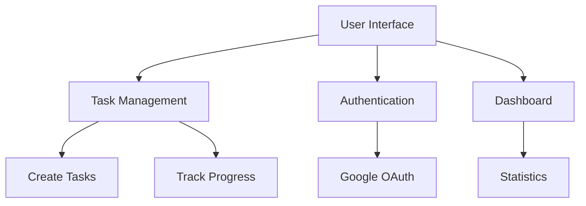
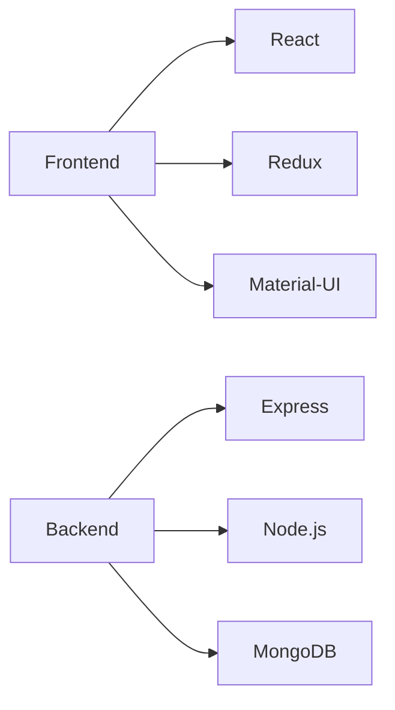
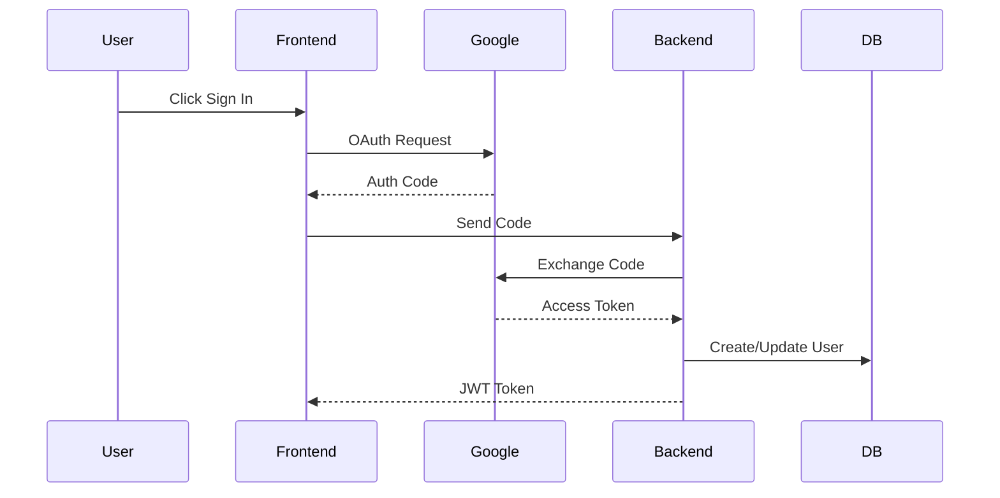
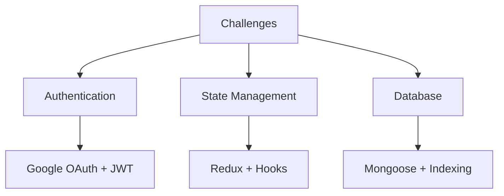
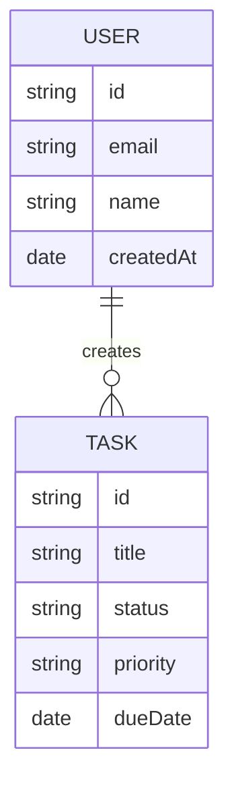
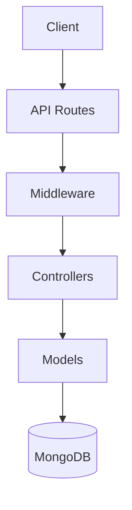
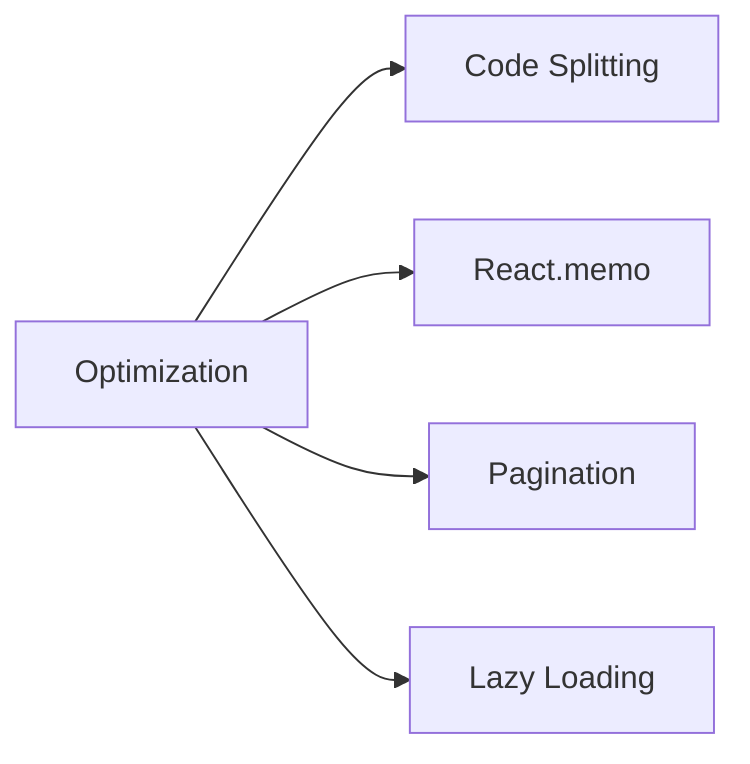
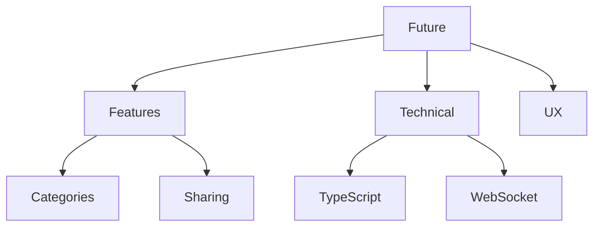

# TaskFlow - Project Presentation
<!-- .slide: data-background="#ffffff" -->

---

# TaskFlow
## A Modern Task Management Application
<!-- .slide: data-background="#f0f0f0" -->

---

# Application Overview
<!-- .slide: data-background="#e3f2fd" -->

---

# Key Features
<!-- .slide: data-background="#e8f5e9" -->

1. **Authentication**
   - One-click Google Sign-in
   - Secure session management
   - Protected routes

2. **Task Management**
   - Create new tasks
   - Set priorities
   - Track status
   - Filter and sort

---

# Technical Stack
<!-- .slide: data-background="#fff3e0" -->

---

# Authentication Flow
<!-- .slide: data-background="#fce4ec" -->

---

# Technical Challenges
<!-- .slide: data-background="#e8eaf6" -->

## 1. Authentication Implementation
- Google OAuth integration
- Session management
- Route protection

## 2. State Management
- Complex application state
- Real-time updates
- Data consistency

---

# Solutions Implemented
<!-- .slide: data-background="#f3e5f5" -->

---

# Database Design
<!-- .slide: data-background="#e0f2f1" -->

---

# API Architecture
<!-- .slide: data-background="#fce4ec" -->

---

# Security Measures
<!-- .slide: data-background="#e8f5e9" -->

- JWT Authentication
- CORS Protection
- Input Validation
- Secure Headers
- Data Sanitization

---

# Performance Optimization
<!-- .slide: data-background="#fff3e0" -->

---

# Learning Outcomes
<!-- .slide: data-background="#e3f2fd" -->

1. **Technical Skills**
   - MERN Stack
   - OAuth Implementation
   - State Management
   - API Design

2. **Project Management**
   - Feature Breakdown
   - Task Prioritization
   - Version Control

---

# Future Improvements
<!-- .slide: data-background="#f3e5f5" -->

---

# Thank You
<!-- .slide: data-background="#ffffff" -->

## Questions? 